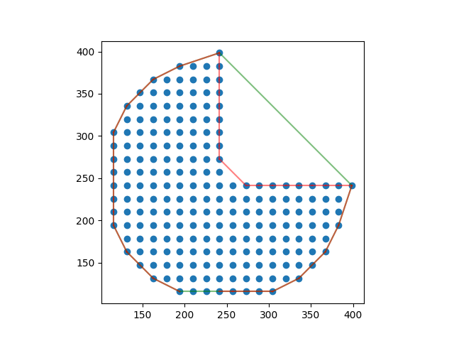

# concave_hull

A very fast 2D concave hull algorithm.



Credits goes to:

-   <https://github.com/mapbox/concaveman>
-   <https://github.com/sadaszewski/concaveman-cpp>

Online document: <https://concave-hull.readthedocs.io/en/latest/>

<!--intro-start-->

## Install

### via pip

```bash
pip install -U concave_hull
```

### from source

```bash
git clone --recursive https://github.com/cubao/concave_hull
pip install ./concave_hull
```

Or

```bash
pip install git+https://github.com/cubao/concave_hull.git
```

(you can build wheels for later reuse by ` pip wheel git+https://github.com/cubao/concave_hull.git`)

## Usage

Signature:

```python
# import
from concave_hull import concave_hull, concave_hull_indexes

# get concave hull indexes
concave_hull_indexes(
       points: Union[numpy.ndarray, List, Tuple],
       *,
       concavity: float = 2.0,
       length_threshold: float = 0.0,
       # you can just ignore "convex_hull_indexes"
       convex_hull_indexes: numpy.ndarray[numpy.int32[m, 1]] = None,
) -> numpy.ndarray[numpy.int32[m, 1]]

# get concave hull points
concave_hull(
       points: Union[numpy.ndarray, List, Tuple],
       ... # same as
) -> Union[numpy.ndarray, List, Tuple]

# P.S., we provide convex_hull (Graham scan)
from concave_hull import convex_hull, convex_hull_indexes
```

-   `concavity` is a relative measure of concavity. 1 results in a relatively
    detailed shape, Infinity results in a convex hull. You can use values lower
    than 1, but they can produce pretty crazy shapes.
-   `length_threshold`: when a segment length is under this threshold, it stops
    being considered for further detalization. Higher values result in simpler
    shapes.

(document from <https://github.com/mapbox/concaveman>)

Example (see full code in [`test.py`](test.py)):

```python
import matplotlib.pyplot as plt
import numpy as np
from scipy.spatial import ConvexHull

from concave_hull import concave_hull, concave_hull_indexes

points = []
c = np.array([250, 250])
for x in np.arange(100, 400, 5 * np.pi):
    for y in np.arange(100, 400, 5 * np.pi):
        if x > c[0] and y > c[1]:
            continue
        r = np.linalg.norm(c - [x, y])
        if r > 150:
            continue
        points.append([x, y])
points = np.array(points)
convex_hull = ConvexHull(points[:, :2])  # it's already N-by-2, I'm just emphasizing

# https://docs.scipy.org/doc/scipy/reference/generated/scipy.spatial.ConvexHull.html

plt.plot(points[:, 0], points[:, 1], "o")
for simplex in convex_hull.simplices:
    plt.plot(points[simplex, 0], points[simplex, 1], "g-", alpha=0.5)

idxes = concave_hull_indexes(
    points[:, :2],
    length_threshold=50,
)
# you can get coordinates by `points[idxes]`
assert np.all(points[idxes] == concave_hull(points, length_threshold=50))

for f, t in zip(idxes[:-1], idxes[1:]):  # noqa
    seg = points[[f, t]]
    plt.plot(seg[:, 0], seg[:, 1], "r-", alpha=0.5)
# plt.savefig('hull.png')
plt.show()
```

<!--intro-end-->

## Tests

```
make python_install
make python_test
```
