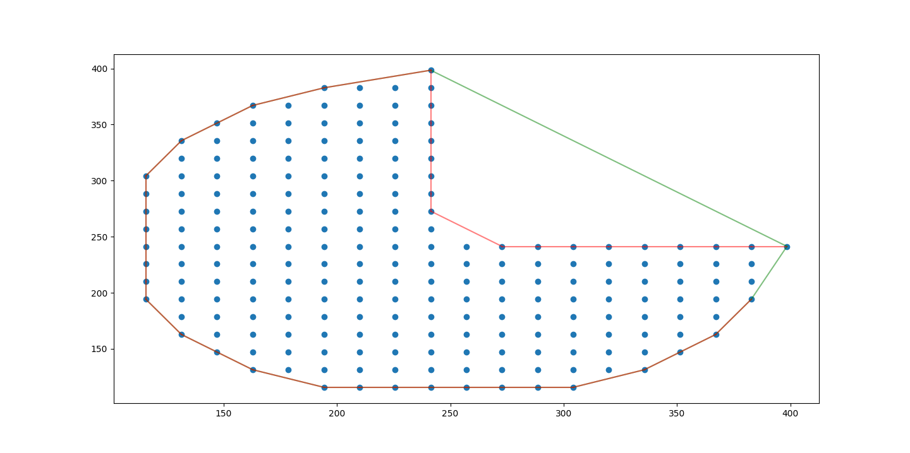

# concave_hull

A very fast 2D concave hull algorithm.



Credits goes to:

-   https://github.com/mapbox/concaveman
-   https://github.com/sadaszewski/concaveman-cpp

## Install

### via pip

```
pip install concave_hull
```

### from source

```bash
git clone --recursive https://github.com/cubao/concave_hull
pip install ./concave_hull
```

Or

```
pip install git+https://github.com/cubao/concave_hull.git
```

(you can build wheels for later reuse by ` pip wheel git+https://github.com/cubao/concave_hull.git`)

## Usage

Signature:

```python
concave_hull_indexes(
       points: numpy.ndarray[numpy.float64[m, 2]],
       *,
       convex_hull_indexes: numpy.ndarray[numpy.int32[m, 1]],
       concavity: float = 2.0,
       length_threshold: float = 0.0,
) -> numpy.ndarray[numpy.int32[m, 1]]
```

-   `concavity` is a relative measure of concavity. 1 results in a relatively
    detailed shape, Infinity results in a convex hull. You can use values lower
    than 1, but they can produce pretty crazy shapes.
-   `lengthThreshold`: when a segment length is under this threshold, it stops
    being considered for further detalization. Higher values result in simpler
    shapes.

(document from <https://github.com/mapbox/concaveman>)

Example (see full code in [`test.py`](test.py)):

```python
from concave_hull import concave_hull_indexes

idxes = concave_hull_indexes(
    points[:, :2],          # it's 2D concave hull, points should be N-by-2 numpy array
    convex_hull_indexes=convex_hull.vertices.astype(np.int32), # can be calculated by scipy
    length_threshold=50,
)

# you can get coordinates by `points[idxes]`
```

## Tests

```
python3 test.py
python3 tests/test_basic.py
```
