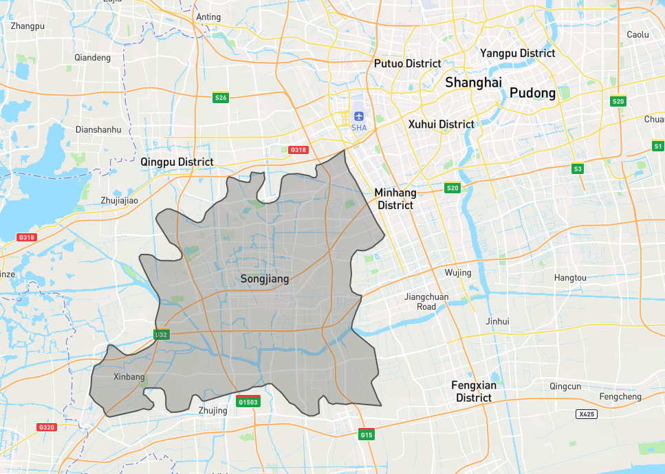
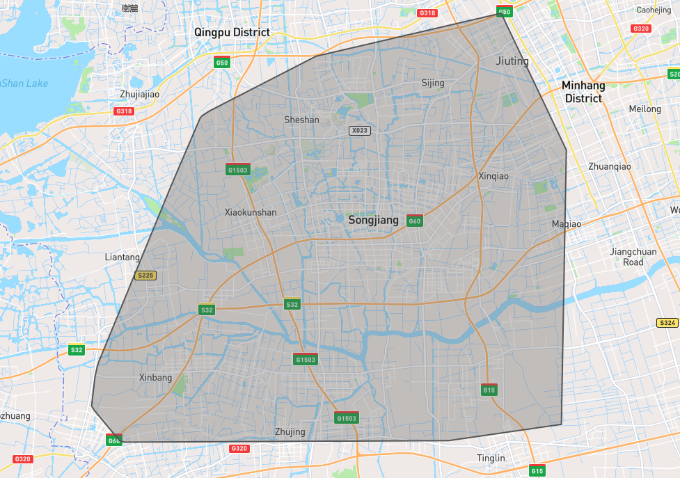
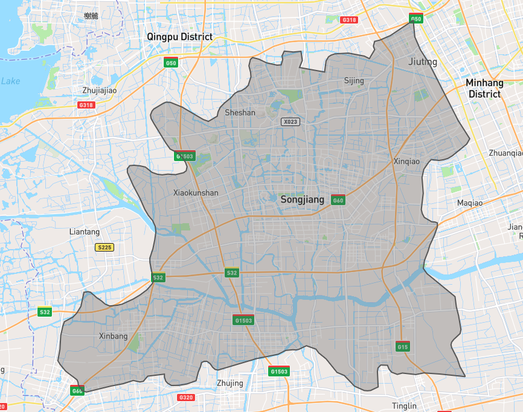
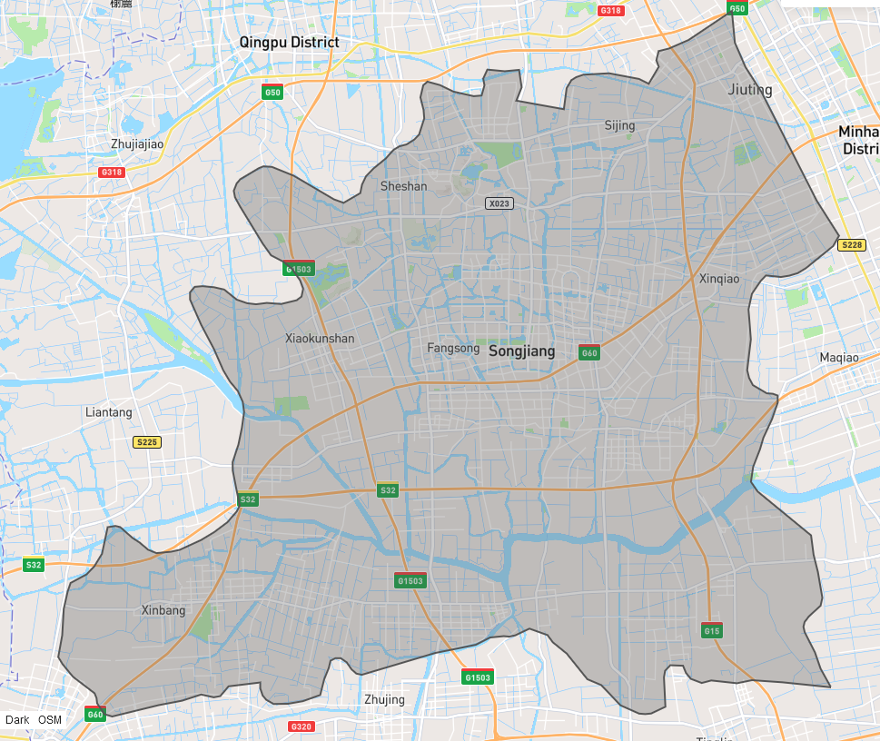
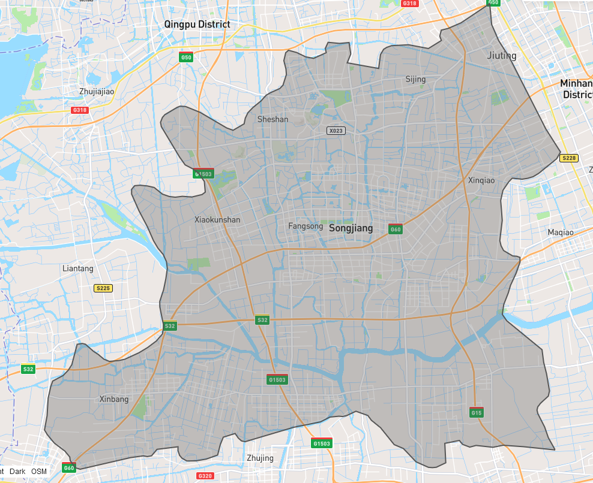
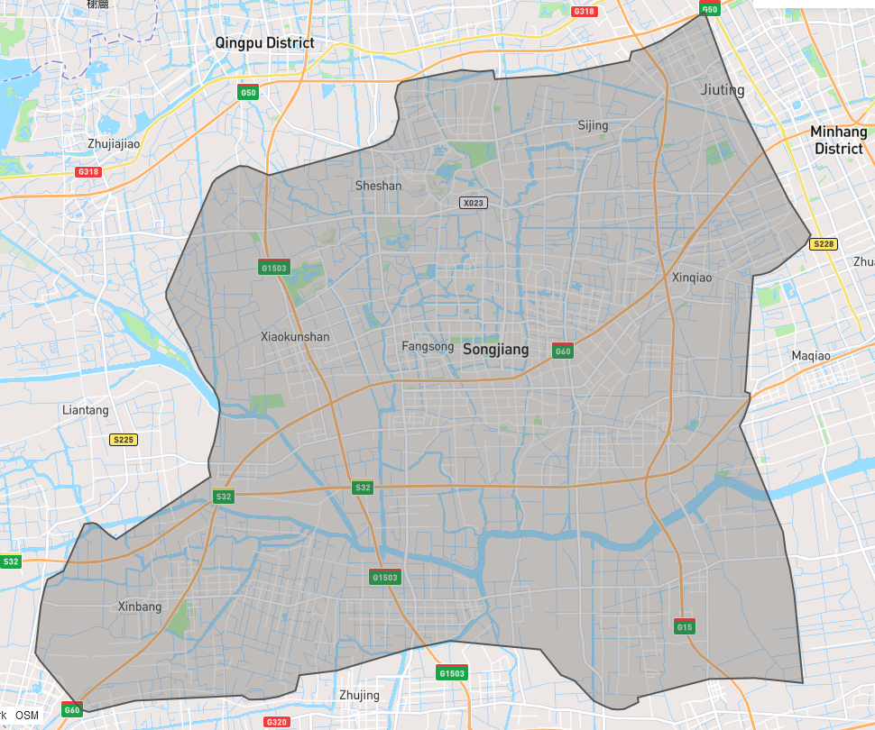
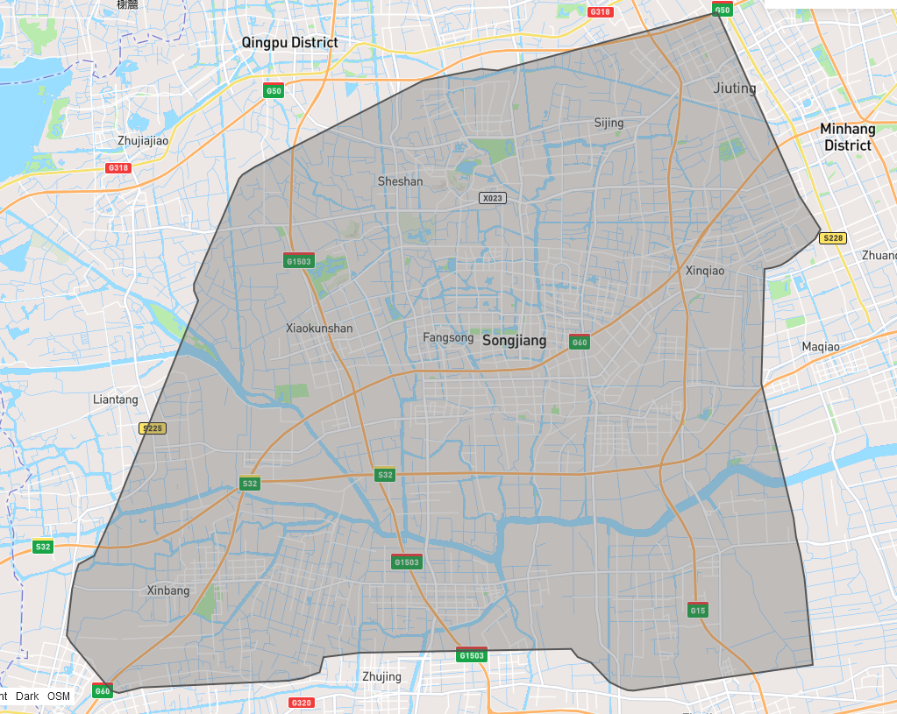
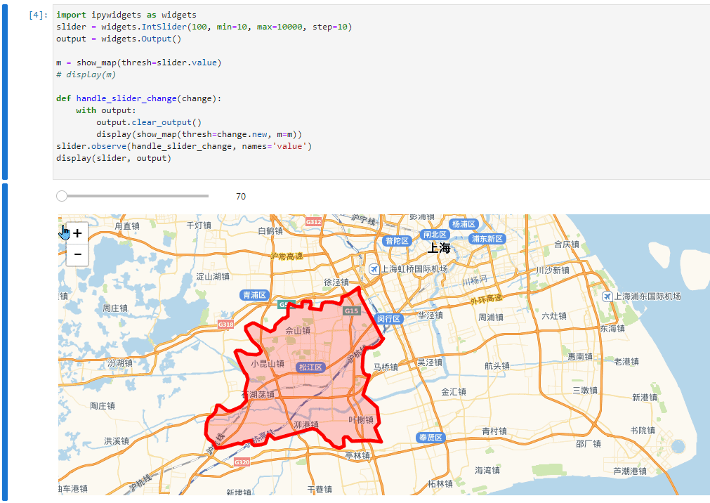

# WGS84

Handling WGS84 (longitude, latitude, used by GPS, etc) coordinates is a pretty common requirement under concave hull use cases.

Give you an example, this is the boundary of Songjiang district, Shanghai, China（中国上海市松江区）: (click image to view in [geojson.io](https://geojson.io))

[](https://geojson.io/#data=data:text/x-url,https%3A%2F%2Fraw.githubusercontent.com%2Fcubao%2Fconcave_hull%2Fmaster%2Fdocs%2Fdata%2Fsongjiang.json)

If you directly pass `[[lon, lat], ...]` to `concave_hull` algorithm, you get something like this:



It's waaay tooo rough. Because wgs84 are degrees in `lon~(-180,+180), lat~(-90,+90)`, they are small numbers!!!

And it's hard to tweat the `length_threshold` under this metric system ([CRS/SRS](https://en.wikipedia.org/wiki/Spatial_reference_system) as you may know).

>   You may know that 1.0 degree in lon/lat is about 100km, then use `0.01` (~1km) as threshold.
>   But it's very tricky to get it right.
>   And the ratio (1 degree -> 100km) varies in lon/lat direction, and varies at different latitude.

## concave_hull with help of mapbox/cheap-ruler

We use [mapbox/cheap-ruler](https://github.com/mapbox/cheap-ruler) to quickly convert WGS84 data (we use `[lon, lat]` order)
to local coordinates (in direction east/north, in meters, [ENU](https://en.wikipedia.org/wiki/Local_tangent_plane_coordinates) as you may have know), so you can have better control over `lenght_threshold` parameter.

Just add `is_wgs84=True` to `concave_hull` or `concave_hull_indexes`:

```python
hull = concave_hull(lon_lats, length_threshold=thresh, is_wgs84=True)
```

| `length_threshold` | Screenshot | View in geojson.io |
| ---: | :--- | :--- |
| 10m |  | [link](https://geojson.io/#data=data:text/x-url,https%3A%2F%2Fraw.githubusercontent.com%2Fcubao%2Fconcave_hull%2Fmaster%2Fdocs%2Fdata%2Fconcave_hull_thresh_10.0_wgs84.json) |
| 100m |  | [link](https://geojson.io/#data=data:text/x-url,https%3A%2F%2Fraw.githubusercontent.com%2Fcubao%2Fconcave_hull%2Fmaster%2Fdocs%2Fdata%2Fconcave_hull_thresh_100.0_wgs84.json) |
| 1,000m |  | [link](https://geojson.io/#data=data:text/x-url,https%3A%2F%2Fraw.githubusercontent.com%2Fcubao%2Fconcave_hull%2Fmaster%2Fdocs%2Fdata%2Fconcave_hull_thresh_1000.0_wgs84.json) |
| 5,000m |  | [link](https://geojson.io/#data=data:text/x-url,https%3A%2F%2Fraw.githubusercontent.com%2Fcubao%2Fconcave_hull%2Fmaster%2Fdocs%2Fdata%2Fconcave_hull_thresh_5000.0_wgs84.json) |
| 10,000m |  | [link](https://geojson.io/#data=data:text/x-url,https%3A%2F%2Fraw.githubusercontent.com%2Fcubao%2Fconcave_hull%2Fmaster%2Fdocs%2Fdata%2Fconcave_hull_thresh_10000.0_wgs84.json) |

## Interactive demo

And there is a jupyter notebook:

-   GitHub: <https://github.com/cubao/index/blob/master/docs/notebooks/concave-hull.ipynb>
-   readthedocs: <https://cubao.readthedocs.io/en/latest/notebooks/concave-hull/>



## other CRS/SRS?

For other CRS/SRS, you need to manually convert it to some cartesian coordinates
with know metric (e.g. unit `1` is `1 meter` in reality), then:

-   use `concave_hull_indexes(cartesian_coords, ...)` to get `indexes`, then
-   use `original_coords[indexes]` to get desired concave hull
